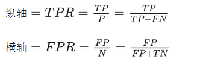

# 线代

矩阵特征值和特征向量
Ax = λx 称λ为特征值
非零向量x是特征向量

# 机器学习基础知识

1. 生成模型与判别模型的区别
   生成联合概率分布P(x,y)，通过贝叶斯求得P(Y|X)
   判别模型，直接学习P(Y/X)

2. 参数模型和非参数模型：
   参数模型假设总体符合某分布，分布由参数决定（如正态分布的均值或方差），高斯混合模型
   非参数模型对总体分布不做假设，算法可以自由从训练数据中学习任意形式函数（决策树）

3. ID3和C4.5是二叉树还是多叉树
   ID3只能处理离散数据，多叉树 ，只用了信息增益
   C4.5可以处理连续数据，离散多叉，连续二叉；
   被切过的特征是否可以再切
   连续可以，离散不行

4. ROC-AUC 与 PR-AUC 的区别与联系，AUC手写
   ROC （Receiver Operating Characteristic），横坐标（TPR），纵轴（FPR）

   

   ROC-AUC（arear-under-curve)是ROC曲线与横轴构成的面积。和Accuracy、Precision、recall、F1 score这些指标不同，AUC的值并不依赖于threshold的选择。PR曲线：纵轴Precision，横轴Recall

数据并行，模型并行还有个什么并行的区别

手写kmeans

bert和gpt中文分词原理

mysql索引，mysql锁，幻读

synchronized

hashmap push过程

kd-tree

vit比cnn

transformer八股

focalloss

Bn层参数（公式）

nms,softnms

chatgpt强化学习？

过拟合处理

训练时梯度nan

c++ 实现kmean
